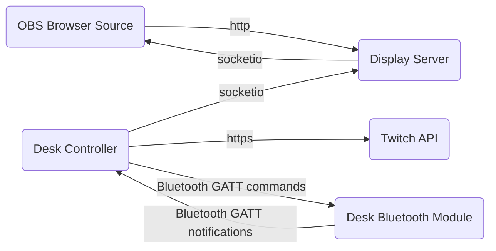

# jddesk

Code powering [Jaedolph](twitch.tv/jaedolph)'s desk related channel points rewards.

The code may be useful for reference by streamers attempting to do a similar thing.

The code is very specific to my setup so would probably require a lot of hacking to get working with another type of desk. I have an [OMNIDESK PRO 2020](https://theomnidesk.com.au/collections/omnidesk-pro-2020) with the optional [bluetooth controller](https://theomnidesk.com.au/products/bluetooth-controller).

# Architecture
The application consists of two parts:
* The display server
* The desk controller

## Display server
The display server is a [Flask](https://flask.palletsprojects.com/) based web application for displaying the desk height. It can be used as a browser source in OBS. The server uses the socketio protocol to receive and transmit real time updates of the desk height.

## Desk controller
The desk controller continually polls the Twitch API for channel point reward redemptions. If there are redemptions in the queue it will send commands to the desk's bluetooth controller.

The desk controller will also listen for "notify" events from the bluetooth controller which show the current height of the desk. These notify events are sent every time the desk moves. Each event is relayed to the display server so the current height of the desk can be displayed in OBS in real time.

## System diagram


# Installation

This package requires several C/C++ libraries in order for the `gattlib` dependency to install properly.

I have only tested running this code on Fedora with Python 3.10.

Installing deps on Fedora:
```bash
sudo dnf install gcc-c++ python3-devel boost-python3-devel glib2-devel bluez-libs-devel
```

## Install using pip
```bash
python3 -m pip install . --user
```

## Build docker image
```
docker build -t jddesk:latest .
```

# Config

Create a config file at `~/.jddesk.ini`

Example config file:
```ini
[BLUETOOTH]
CONTROLLER_MAC = 01:02:03:04:05:06

[DISPLAY_SERVER]
URL = http://localhost:5000

[TWITCH]
AUTH_TOKEN = 1234567890abcdefghijklmnopqrst
CLIENT_ID = abcdefghijklmnopqrst1234567890
BROADCASTER_ID = 12345678
```

`CONTROLLER_MAC` is the MAC address of the desk's bluetooth controller.

`URL` is the url of the display server.

(TODO: Automate this process more)
You can get your `BROADCASTER_ID` from a site like this: https://www.streamweasels.com/tools/convert-twitch-username-to-user-id/


The `CLIENT_ID` you can get by creating an "application" here: https://dev.twitch.tv/console/apps/create

Once you have the `CLIENT_ID`, you can get the `AUTH_TOKEN` from here (it will be included in the URL you get redirected to): https://id.twitch.tv/oauth2/authorize?client_id=abcdefghijklmnopqrst1234567890&redirect_uri=http://localhost&response_type=token&scope=channel:read:redemptions%20channel:manage:redemptions%20openid

# Running the program

Ensure bluetooth is enabled.

Run the display server:
```
jddesk-display
```

Run the desk controller:
```
jddesk-controller
```

The web server will run on port 5000, you can set up a browser source in OBS to display the desk
height in real time using http://yourhostname:5000.

# Running with Docker/Podman
```
# ensure selinux perms are correct on your config file
chcon -t container_file_t ~/.jddesk.ini

# run the display server
docker run --name jddesk-display -p 5000:5000 docker.io/jaedolph/jddesk:latest jddesk-display

# run the controller
docker run --name jddesk-controller --net=host -v /var/run/dbus/:/var/run/dbus/ \
    -v ~/.jddesk.ini:/usr/src/app/.jddesk.ini docker.io/jaedolph/jddesk:latest
```

# Running on Kubernetes
I have only tested this on k3s running on a Raspberry Pi.

Edit the [kustomize.yml](kustomize/kustomize.yml) file and add the hostname of your desired route for the display server.

Edit the [.jddesk.ini](kustomize/.jddesk.yml) config file. This can be used to generate a secret with your config file.

Apply the resources:
```
kubectl kustomize kustomize/ | kubectl apply -f -
```

